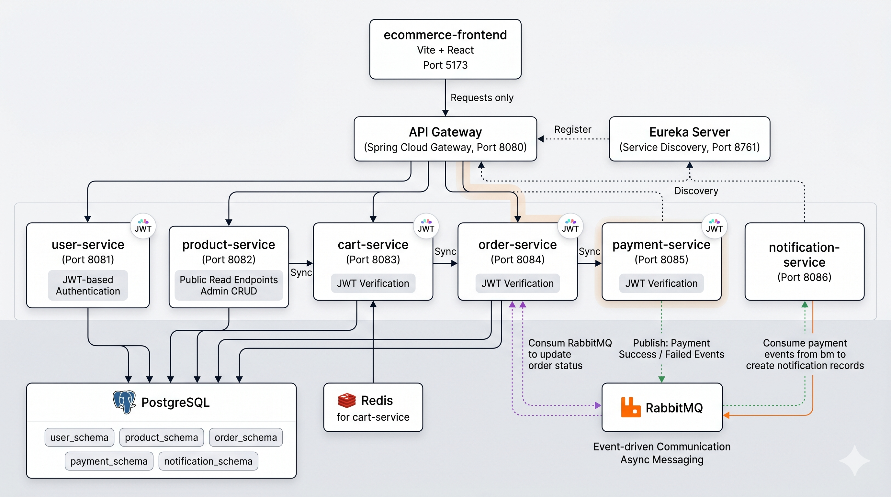
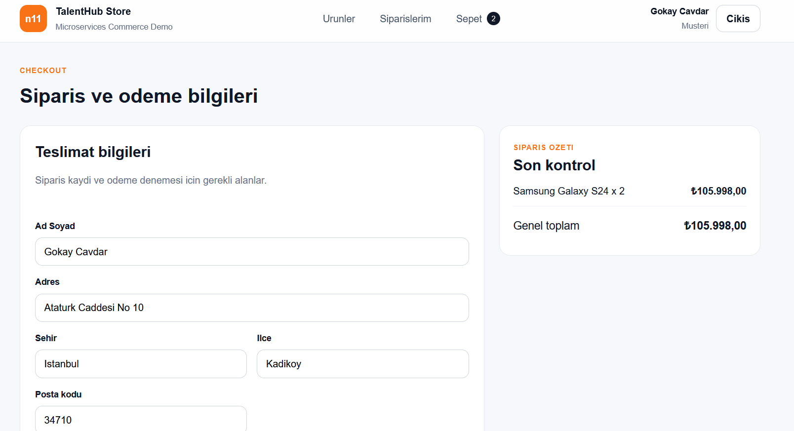

# n11 TalentHub Final Project - Fullstack E-Commerce

Spring Boot mikroservis mimarisi ve React tabanlı frontend ile geliştirilmiş bir e-ticaret uygulaması. Bu proje; kimlik doğrulama, ürün listeleme, sepet yönetimi, sipariş oluşturma, 3DS ödeme akışı ve event-driven bildirim üretimi gibi temel e-ticaret senaryolarını uçtan uca kapsar.



## Proje Özeti

Bu projede aşağıdaki temel akışlar çalışır:

- JWT tabanlı authentication ve authorization
- Pagination destekli ürün listeleme
- Redis tabanlı sepet yönetimi
- Checkout ve sipariş oluşturma
- 3DS ödeme başlatma ve callback akışı
- RabbitMQ üzerinden payment event yayınlama ve tüketme
- Notification oluşturma
- Swagger/OpenAPI dokümantasyonu
- Correlation ID ile log izlenebilirliği
- Docker Compose ile toplu çalıştırma
- Backend image build için Jib kullanımı

## Teknoloji Yığını

### Backend
- Java 21
- Spring Boot 4
- Spring Security
- Spring Cloud Gateway
- Spring Cloud Netflix Eureka
- Spring Data JPA
- Flyway
- PostgreSQL
- Redis
- RabbitMQ
- Springdoc OpenAPI
- JUnit 5 / Mockito
- Jib

### Frontend
- React
- Vite
- React Router

### DevOps
- Docker
- Docker Compose
- Jib

## Mikroservisler

| Servis | Sorumluluk |
| --- | --- |
| `api-gateway` | Tüm istemci isteklerini karşılar, route yönetimi yapar, CORS ve correlation id uygular |
| `eureka-server` | Service discovery görevini üstlenir |
| `user-service` | Register, login, refresh token, logout, current user ve JWT yönetimi |
| `product-service` | Ürün listeleme, detay, admin CRUD ve soft delete |
| `cart-service` | Redis tabanlı sepet yönetimi |
| `order-service` | Checkout akışının merkezi, sipariş oluşturma ve payment event tüketimi |
| `payment-service` | 3DS ödeme başlatma, callback alma, payment event yayınlama |
| `notification-service` | Payment event'lerini dinleyip bildirim kaydı oluşturma |

## Mimari Akış

1. Frontend tüm istekleri `api-gateway` üzerinden gönderir.
2. Gateway, ilgili isteği uygun mikroservise route eder.
3. `user-service` JWT üretir ve refresh token'ı HttpOnly cookie ile yönetir.
4. `cart-service`, ürün doğrulaması için `product-service` ile haberleşir.
5. `order-service`, checkout sırasında sepeti alır ve `payment-service` üzerinden 3DS ödeme başlatır.
6. `payment-service`, callback sonrasında RabbitMQ'ya success veya failed event gönderir.
7. `order-service` bu event'leri tüketerek sipariş durumunu günceller.
8. `notification-service` aynı event'leri tüketerek bildirim kaydı üretir.

## Veri ve Mesajlaşma Katmanı

- PostgreSQL
  - `user_schema`
  - `product_schema`
  - `order_schema`
  - `payment_schema`
  - `notification_schema`
- Redis
  - sepet verisi
- RabbitMQ
  - payment success / payment failed event'leri

## Güvenlik

- JWT tabanlı authentication kullanılır.
- Refresh token HttpOnly cookie ile tutulur.
- Protected endpoint'ler access token ile korunur.
- Admin ürün endpoint'leri yetki gerektirir.

## Loglama

Tüm kritik request ve event akışlarında correlation id kullanılır.

Örnek izlenebilirlik noktaları:

- gateway request logları
- servis request logları
- Feign çağrıları
- payment event yayınlama
- Rabbit listener işleme akışı

Bu sayede tek bir checkout zinciri loglar üzerinden takip edilebilir.

## Frontend Özellikleri

- Ürün listeleme
- Pagination
- Ürün detay sayfası
- Login / register
- Sepet yönetimi
- Checkout formu
- 3DS ödeme session ekranı
- Siparişlerim
- Sipariş detay
- Loading ve error state'leri

## Frontend Ekran Görüntüleri

Bu bölüm frontend demo ekran görüntüleri için ayrılmıştır. Görselleri aşağıdaki klasöre ekleyebilirsin:

```text
images/frontend/
```

Önerilen ekran görüntüleri:

- ana sayfa / ürün listeleme
- ürün detay sayfası
- sepet ekranı
- checkout ekranı
- 3DS ödeme akışı
- siparişlerim
- sipariş detay

Görselleri ekledikten sonra aşağıdaki formatı kullanabilirsin:

```md
### Ana Sayfa


### Ürün Detay


### Sepet


### Checkout


### 3DS Ödeme Akışı


### Siparişlerim

```

## Testler

Aşağıdaki servislerde unit testler yazılmıştır:

- `user-service`
- `product-service`
- `cart-service`
- `order-service`
- `payment-service`
- `notification-service`

Kapsanan temel konular:

- auth service
- jwt service
- refresh token service
- ürün servis mantığı
- sepet servis mantığı
- checkout akışı
- payment callback akışı
- event listener davranışı
- notification oluşturma mantığı

## Swagger

- User Service: [http://localhost:8081/swagger-ui.html](http://localhost:8081/swagger-ui.html)
- Product Service: [http://localhost:8082/swagger-ui.html](http://localhost:8082/swagger-ui.html)
- Cart Service: [http://localhost:8083/swagger-ui.html](http://localhost:8083/swagger-ui.html)
- Order Service: [http://localhost:8084/swagger-ui.html](http://localhost:8084/swagger-ui.html)
- Payment Service: [http://localhost:8085/swagger-ui.html](http://localhost:8085/swagger-ui.html)
- Notification Service: [http://localhost:8086/swagger-ui.html](http://localhost:8086/swagger-ui.html)
- API Gateway: [http://localhost:8080/swagger-ui.html](http://localhost:8080/swagger-ui.html)

## Docker ile Çalıştırma

### 1. Backend image'lerini Jib ile oluştur

```powershell
$services = "eureka-server","api-gateway","user-service","product-service","cart-service","order-service","payment-service","notification-service"
foreach ($service in $services) {
  Push-Location $service
  .\mvnw clean package jib:dockerBuild -DskipTests
  Pop-Location
}
```

### 2. Tüm sistemi ayağa kaldır

```powershell
docker compose up --build -d --force-recreate
```

### 3. Sistemi durdur

```powershell
docker compose down
```

## Erişim Adresleri

- Frontend: [http://localhost:5173](http://localhost:5173)
- API Gateway: [http://localhost:8080](http://localhost:8080)
- Eureka: [http://localhost:8761](http://localhost:8761)
- RabbitMQ Management: [http://localhost:15672](http://localhost:15672)

## Örnek Ödeme Senaryoları

Mock payment provider ile hızlı test için:

- Başarılı ödeme: `5555444433331111`
- Başarısız ödeme: `5555444433330000`

Kart numarası `0000` ile bitiyorsa ödeme `PAYMENT_FAILED` olur.

## Önemli Mimari Kararlar

- Sepet verisi Redis'te tutulur.
- Ürün silme işlemi soft delete ile yapılır.
- Payment provider katmanı abstraction ile tasarlanmıştır.
- Mock provider ile başarılı / başarısız ödeme senaryoları test edilebilir.
- Event-driven akış RabbitMQ ile modellenmiştir.
- Log traceability için correlation id kullanılır.

## Bilinen Not

Ödeme tarafında şu anda gerçek Iyzico entegrasyonu yerine `MockPaymentProvider` kullanılmaktadır. Ancak `PaymentProvider` abstraction'ı hazır olduğu için gerçek provider entegrasyonu eklemeye uygun bir yapı mevcuttur.

## Geliştirilebilecek Alanlar

- Gerçek Iyzico adapter implementasyonu
- GitHub Actions CI/CD pipeline
- AWS deployment
- Admin ürün yönetim arayüzünün genişletilmesi
- Notification listeleme ekranı
- Monitoring ve deploy bildirimleri
